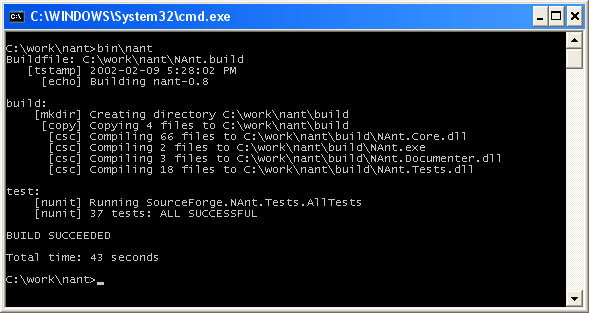

Title: Getting started
Order: 40
---

This topic will show you NAnt building itself.  Before you begin make sure your system meets the [system requirements](system-requirements).

1. Download the latest [source release](http://sourceforge.net/project/showfiles.php?group_id=31650).
2. Unzip the distribution into a new folder.
3. Open a command prompt and change the directory to the folder where NAnt was installed.
4. Type bin\nant to build NAnt.
5. Look at the [NAnt.build](http://cvs.sourceforge.net/cgi-bin/viewcvs.cgi/nant/nant/NAnt.build?rev=HEAD&content-type=text/vnd.viewcvs-markup) file to see how it works.

If you did everything correctly you should see something like this:
